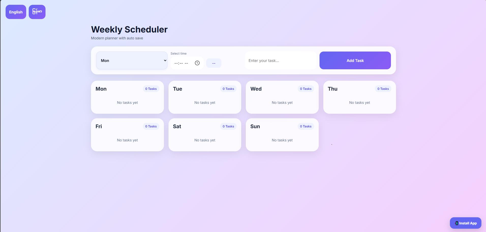

# 📅 Weekly Scheduler

A modern and responsive weekly task planner built with HTML, CSS, and JavaScript. This project helps users organize their weekly activities with a clean user interface, time scheduling, multilingual support, and automatic local storage saving.

---

## ✨ Features

- 📆 Organize tasks from Monday to Sunday
- ⏰ Schedule tasks with specific times
- 💾 Automatic save using Local Storage
- 🌐 Language switching (English / Myanmar)
- 🎨 Modern and clean gradient design
- 📱 Responsive layout
- 📝 Easy task creation and management
- 📊 Task counter for each day
- 🔄 Data persists after browser refresh
- ⚡ Fast and lightweight (no frameworks)

---

## 📸 Preview



---

## 🚀 Live Demo

If deployed with GitHub Pages:

```text
https://yourusername.github.io/weekly-scheduler/
```

---

## 🛠️ Built With

- HTML5
- CSS3
- JavaScript (Vanilla JS)
- Local Storage API

---

## 📂 Project Structure

```text
weekly-scheduler/
│
├── index.html
├── style.css
├── script.js
├── screenshot.png
└── README.md
```

---

## 🎯 How to Use

1. Select a day of the week.
2. Choose a time.
3. Enter your task.
4. Click **Add Task**.
5. The task will appear under the selected day.
6. Your tasks are automatically saved in your browser.
7. Refresh the page anytime without losing your data.

---

## 🌍 Language Support

Currently supported:

- 🇺🇸 English
- 🇲🇲 Myanmar (Burmese)

Planned support:

- 🇹🇭 Thai
- 🇯🇵 Japanese

---

## 🔮 Future Improvements

- [ ] Edit tasks
- [ ] Delete confirmation dialog
- [ ] Dark mode
- [ ] Task categories
- [ ] Drag and drop tasks
- [ ] Weekly progress tracking
- [ ] Export tasks to PDF
- [ ] Cloud synchronization
- [ ] Mobile app version
- [ ] Notification reminders

---

## 💡 Project Goal

This project was created to practice front-end web development while building a useful productivity tool for everyday use. The focus was on creating a modern interface, improving JavaScript skills, and implementing browser-based data persistence using Local Storage.

---

## 📚 What I Learned

Through this project, I gained experience with:

- DOM Manipulation
- Event Handling
- Local Storage
- Responsive Design
- CSS Flexbox & Grid
- UI/UX Design Principles
- Multilingual Interface Development
- JavaScript Data Management

---

## ⚙️ Installation

Clone the repository:

```bash
git clone https://github.com/yourusername/weekly-scheduler.git
```

Open the project folder:

```bash
cd weekly-scheduler
```

Run the application:

```text
Open index.html in your browser
```

No additional dependencies are required.

---

## 🤝 Contributing

Contributions, suggestions, and improvements are welcome.

1. Fork the repository
2. Create a new branch

```bash
git checkout -b feature-name
```

3. Commit your changes

```bash
git commit -m "Add new feature"
```

4. Push to GitHub

```bash
git push origin feature-name
```

5. Create a Pull Request

---

## 👨‍💻 Author

**Jucie Wiki**

Aspiring Full-Stack Developer

- Interested in Web Development
- Learning Backend Development
- Exploring AI Technologies
- Building Productivity Tools

GitHub:

```text
https://github.com/kizeki-dot
```

---

## 📄 License

This project is licensed under the MIT License.

Feel free to use, modify, and distribute this project.

---

## ⭐ Support

If you found this project useful, consider giving it a star ⭐ on GitHub.

It helps support the project and motivates future improvements.
